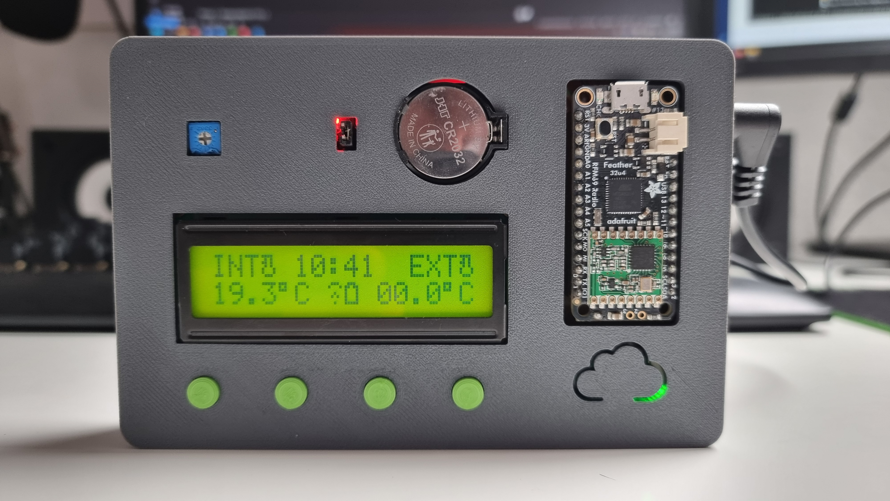

# Feather-Weather

### Qu'est-ce ?
Ce dépot contient le code source d'une **station météorologique** réalisée avec le framework **Arduino**. Elle est divisée en deux unités, équipées chacune de la carte **Adafruit Feather 32u4** Radio, qui travaillent séparément pour fournir des données sur la température et l'humidité ambiante à l'intérieur et à l'extérieur de l'habitacle. La communication entre ces deux unités se fait avec le module **rfm69hcw** sur la fréquence 433 MHz, ce qui permet l'échange de données sur une longue distance.

### Fonctionnalités
- [x] affichage des informations grâce à un écran LCD (16 x 2)
- [x] persistance du comptage de l'heure après coupure de courant (DS3231 RTC)
- [x] affichage de la température et de l'humidité ambiante  (ATH20)
- [x] configuration de l'heure par interface graphique
- [x] navigation dans les menus grâce à quatre bouton poussoires
- [x] voyant indicateur de d'état de batterie et qualité de réception
- [ ] historique des températures (min et max)
- [ ] possibilité de consulter le voltage de la batterie à distance

### TODO
- [x] suppression de la dépendance JSON
- [ ] reduction de l'utilisation de l'i2c pour augmenter la fiabilité du capteur de température (trop de requêtes = surchauffe)
- [ ] suppression de l'utilisation des print-format, trop gourmands pour AVR

## Compilation & Usage
### 1. Cloner le repo git
```bash
git clone https://github.com/stackOverHeap/feather-weather.git
```
### 2. Compiler avec platformIO
```bash
pio run
```
### 3. Flasher sur un micro
flash du code s'éxecutant sur la station interne
```bash
pio run --target upload --environment feather32u4_ISTA
```
flash du code s'éxecutant sur la station externe
```bash
pio run --target upload --environment feather32u4_ESTA
```
### 4. Verifier la connexion entre les dispositifs
Pour ceci, s'assurer que l'icone de connexion n'apparaît pas sur l'interface de l'appareil. Un certain temps peut être nécessaire avant la détection du signal.